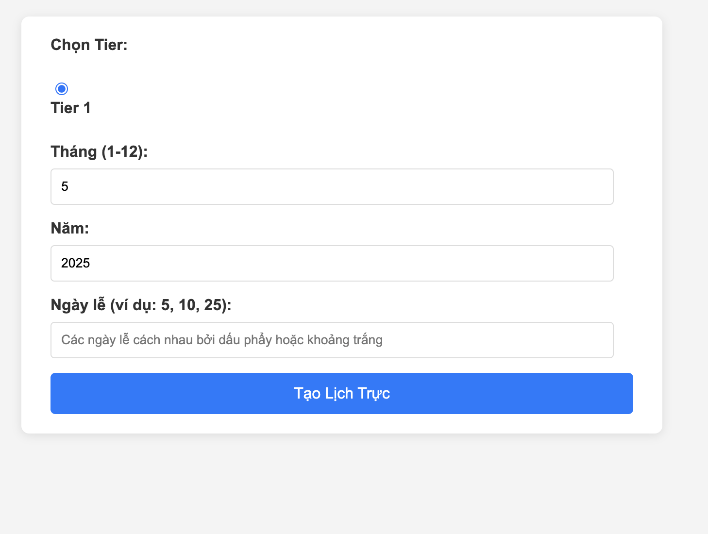
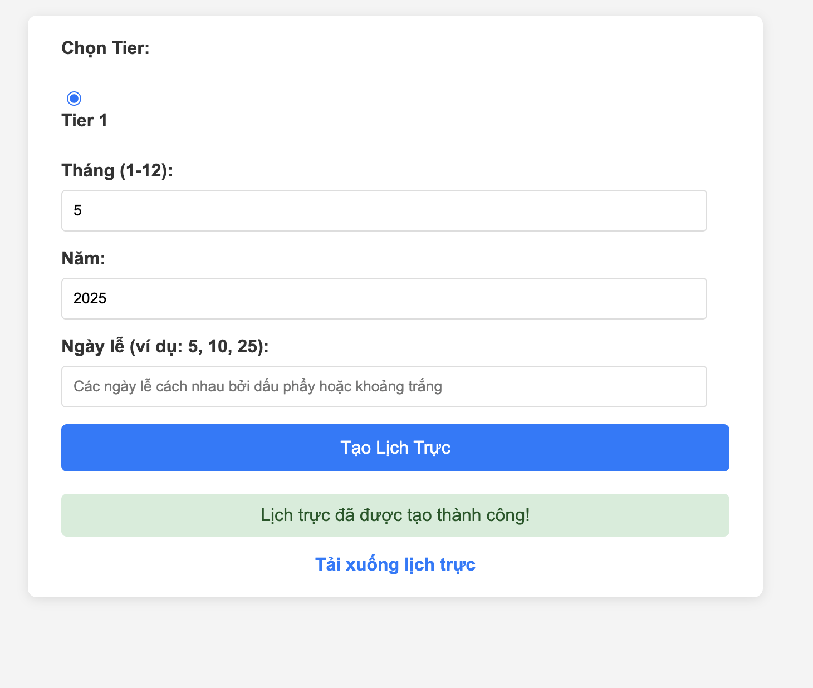
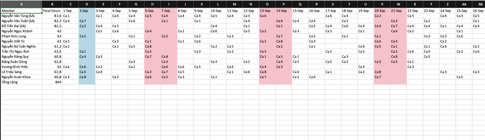

## Cài đặt
Tạo môi trường ảo (Virtual Environment)
```bash
python3 -m venv venv
```
Kích hoạt môi trường ảo
```bash
source venv/bin/activate
```
Cài đặt thư viện

```bash
pip install -r requirements.txt
```

## Hướng dẫn dùng
1. Chạy file tier_1.py
```bash
(venv) hieu.vuong@MBA010060 shift-schedule % python3 app.py
```
2. Truy cập URL: http://127.0.0.1:5000/
3. Nhập ngày tháng

4. Tải file về 

5. File excel


## Ràng buộc

1. Mỗi người chỉ 1 ca/ngày
2. Ca 4 trong tuần chỉ SA, chia đều ca 4 cho các thành viên SA
3. Không cho cùng lúc 3 ca 1,2,3 liền nhau
4. Không có ca 1,2,3 sau ca muộn (Ca 5, Ca 6 trong tuần; Ca 7, Ca 8 cuối tuần/lễ)
5. Cân bằng loại ca trong tuần, cuối tuần cho mỗi thành viên gần bằng nhau (sai lệch +/- 1 ca)
6. Cân bằng tổng số ca 1,2,3 trong tuần, cuối tuần cho mỗi thành viên gần bằng nhau (sai lệch +/- 1 ca)
7. SA hơn non-SA khoảng 20 giờ (sai lệch +/- 1 giờ)
8. Cân bằng số giờ mỗi thành viên (sai lệch +/- 1 ca)
